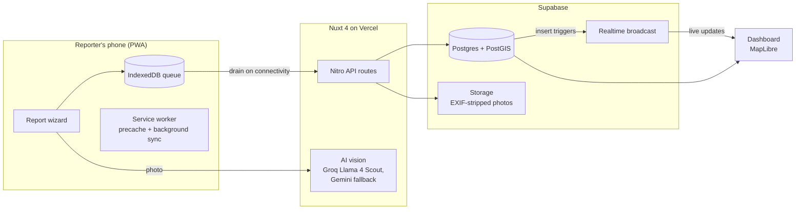
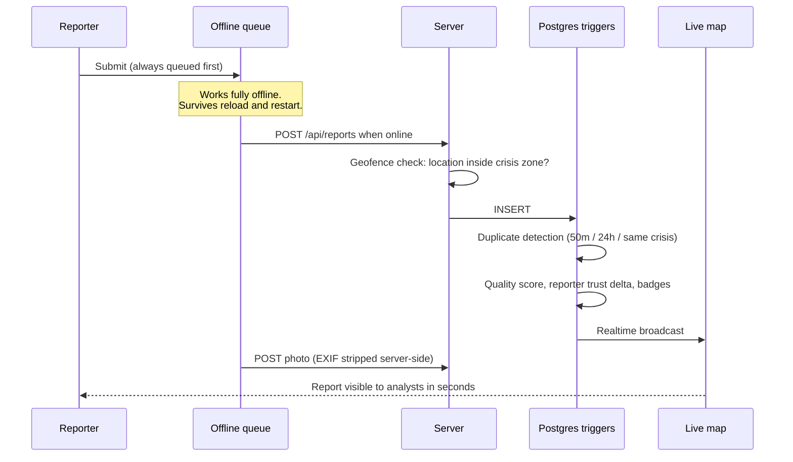
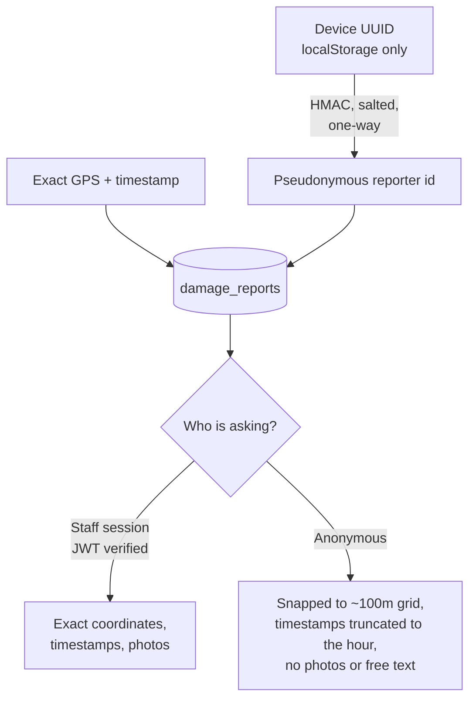

# CrisisMapper

Offline-first crisis damage reporting, built for the UNDP "Build the Future of Crisis Mapping" challenge.

**Live demo:** https://crisismapper.vercel.app
**Staff console:** https://crisismapper.vercel.app/login — `demo@crisismapper.app` / `CrisisMapper#Demo2026` (sandbox account, intentionally public for evaluation)

---

## The problem

When an earthquake or flood hits, the first 48 hours decide who gets help. Satellite imagery arrives quickly but cannot see whether a standing building is safe to enter, whether a bridge that looks intact will hold a truck, or whether the clinic behind an undamaged facade has power. That ground truth lives with the people standing in front of the damage, and they are exactly the people most likely to have no connectivity, no familiarity with GIS tools, and no time to learn one.

After the 2025 Myanmar earthquake, remote analysis gave responders a rapid overview of affected areas but lacked detail on the functional state of roads, bridges, and public facilities. Access constraints delayed ground assessments, leaving information gaps in the days that mattered most.

CrisisMapper closes that gap. A civilian with a smartphone opens a web page, takes a photo, and taps through four steps. The report is geotagged, AI-classified, deduplicated, trust-scored, and lands on a live analyst map in seconds, or whenever connectivity returns. No app store, no account, no training.

## Try it in 60 seconds

1. Open https://crisismapper.vercel.app and press **Open Reporter**.
2. Take or choose a photo of any building. The AI suggests a damage severity; confirm or correct it.
3. Allow location access (or type a Plus Code). The report attaches to the crisis zone containing you. The demo seeds fourteen regional scenarios spanning every continent, so wherever you are there is almost certainly one nearby; report from the open ocean and you will see the "no active crisis in your area" path instead.
4. Pick an infrastructure type, optionally answer the structured situation questions, and submit.
5. Open the **Dashboard** to see your report on the live map, then the **Leaderboard** and your profile to see the gamification layer.
6. To see the offline path: turn on airplane mode before submitting. The report is saved on the device and synced automatically when you reconnect.

Staff features (exact coordinates, photo access, report moderation, GIS exports, crisis management) require signing in with the demo account above.

## How it works



A report's life, from capture to map:



Privacy is enforced at the query layer, not the UI:



No names, phone numbers, or emails are ever collected. Reporters are identified only by a random device UUID that never leaves the phone unhashed. The leaderboard shows generated nicknames that cannot be linked back to a person.

## What is in the box

- **Reporter PWA** (`/report`): five-step wizard with camera capture, on-device photo compression, blur and face warnings, AI severity suggestion with mandatory human confirmation, GPS with Plus Code fallback, and structured Core Questions (electricity, health services, community needs, vulnerable groups, affected population).
- **Offline-first pipeline**: every submission is queued in IndexedDB first, then drained. Android gets OS-level background sync; everything else drains on reconnect or next visit. Poison payloads are dropped instead of blocking the queue.
- **Live dashboard** (`/dashboard`): MapLibre map with clustering, heatmap, building footprints, severity / infrastructure / time filters, a live activity feed over Supabase Realtime with a polling fallback, and a per-report detail modal. Public, with the anonymized projection above; staff sessions see exact data.
- **Geofenced crises**: operators draw a bounding box per crisis; reporters are matched to the zone containing them and the server rejects reports outside it. Locations with no active crisis get a clear "no active crisis in your area" notice rather than a misattributed report. See [docs/DEMO_DATA.md](docs/DEMO_DATA.md) for the seeded demo scenarios.
- **GIS export** (staff): GeoJSON, CSV, GeoPackage, and Shapefile, streamed from a database cursor so a 500K-report crisis exports in bounded memory. The schema follows the challenge specification: decimal-degree coordinates, ISO timestamps, three-tier `damage_classification` (Minimal / Partial / Complete), `infrastructure_type`, `hazard_type`, and the Core Questions columns.
- **Trust and quality scoring**: database triggers score every report (photo quality, AI confidence, GPS method, detail completeness, cross-reporter corroboration within 50m and 24h) and maintain a per-reporter trust tier. Probable duplicates are flagged and excluded from analyst views by default.
- **Gamification**: badges, coverage impact, and an anonymous leaderboard to sustain reporting after the first burst of attention.
- **Seven languages** including full Arabic RTL, plus a staff tool (`/admin/languages`) that bootstraps new language packs through a self-hosted LibreTranslate instance, so locale coverage grows without code changes or external translation vendors.
- **Staff console** (`/admin`): crisis creation with map-drawn zones, report verification and flagging, staff account management, language packs.

## Stack

| Layer | Choice | Why |
|---|---|---|
| Framework | Nuxt 4 (Vue 3) | One codebase for the SSR landing, PWA, and API routes |
| Styling | Tailwind CSS v4 | Design tokens in one `@theme` block |
| Database | Supabase Postgres + PostGIS | Geospatial queries, RLS, realtime, and storage in one place |
| Map | MapLibre GL + OpenFreeMap | Open source, no API key, custom basemap style |
| AI vision | Groq (Llama 4 Scout), Gemini fallback | Fast damage classification with graceful degradation to manual |
| Offline | Dexie (IndexedDB) + Workbox | Queue-first submission, precached shell |
| Hosting | Vercel | Zero-config Nuxt deployment; local setup works too |
| MT engine | LibreTranslate (self-hosted) | Language packs without sending text to a vendor |
| Testing | Playwright | 100+ end-to-end tests, desktop and mobile profiles |

## Local setup

Prerequisites: Node.js 20+, a Supabase project (free tier works).

```bash
git clone https://github.com/Phinart98/crisismapper.git
cd crisismapper
npm install
cp .env.example .env   # fill in values, see the table below
npm run dev
```

Apply the SQL files in `supabase/migrations/` to your project in filename order (Supabase SQL editor or CLI). The app runs at `http://localhost:3000`.

### Environment variables

| Variable | Required | Purpose |
|---|---|---|
| `NUXT_DB_URL` | yes | Supavisor pooler URL (transaction mode, port 6543, `?prepareThreshold=0`) |
| `NUXT_PUBLIC_SUPABASE_URL` | yes | Supabase project URL (realtime + auth) |
| `NUXT_PUBLIC_SUPABASE_ANON_KEY` | yes | Supabase anon key |
| `NUXT_SUPABASE_SERVICE_KEY` | yes | Service role key (photo storage, staff provisioning) |
| `NUXT_REPORTER_SALT` | production | HMAC salt for pseudonymous reporter ids. Generate 32 random bytes once and never rotate it; changing it orphans all reporter history. Dev has a built-in fallback. Without it, reports are stored anonymously and profiles and the leaderboard stay empty. |
| `NUXT_PUBLIC_DEMO_CRISIS_ID` | recommended | Fallback crisis UUID for the reporter flow |
| `NUXT_GROQ_API_KEY` | optional | Primary AI vision provider; with no vision key the wizard falls back to manual severity selection |
| `NUXT_GEMINI_API_KEY` | optional | Fallback vision provider |
| `NUXT_LIBRE_TRANSLATE_URL` | optional | Self-hosted LibreTranslate for `/admin/languages` (`docker run -ti --rm -p 5000:5000 libretranslate/libretranslate`) |
| `NUXT_LIBRE_TRANSLATE_API_KEY` | optional | Only for keyed hosted instances |

## Project structure

```
app/
  pages/              # landing, report, dashboard, me, leaderboard, login, admin/*
  components/         # report wizard, dashboard map + feed, admin console, PWA prompts
  composables/        # useReportForm, useOfflineQueue, useCrisisReports, useStaff, ...
  utils/              # Dexie schema, drain queue, severity model, AI types
  service-worker/     # Workbox precache + background sync
server/
  api/                # reports, map, export, ai, admin, auth, translate
  utils/              # db pool, requireStaff, privacy projection, EXIF strip, exporters
supabase/migrations/  # schema, triggers (dedup/trust/quality/badges), RLS, seeds
i18n/locales/         # en master + es fr ar ru zh sw (key parity enforced by a test)
tests/e2e/            # Playwright suite
docs/                 # architecture, AI methodology and validation
```

## Testing

```bash
npx playwright install chromium   # once
npm run test:e2e                  # full suite, desktop + Pixel 7 profiles
npm run test:e2e:chromium         # faster desktop-only run
npm run typecheck
```

The suite runs against the dev server. A route guard rejects any unmocked mutating API call, so test runs cannot pollute the connected database. The one intentionally real write path (`tests/e2e/real-submit.spec.ts`) is disabled unless `E2E_REAL_SUBMIT=1` is set, and it cleans up after itself.

Architecture details, the trust scoring formula, the privacy model, and the geofencing design are documented in [docs/ARCHITECTURE.md](docs/ARCHITECTURE.md).

## License

[MIT](LICENSE)
