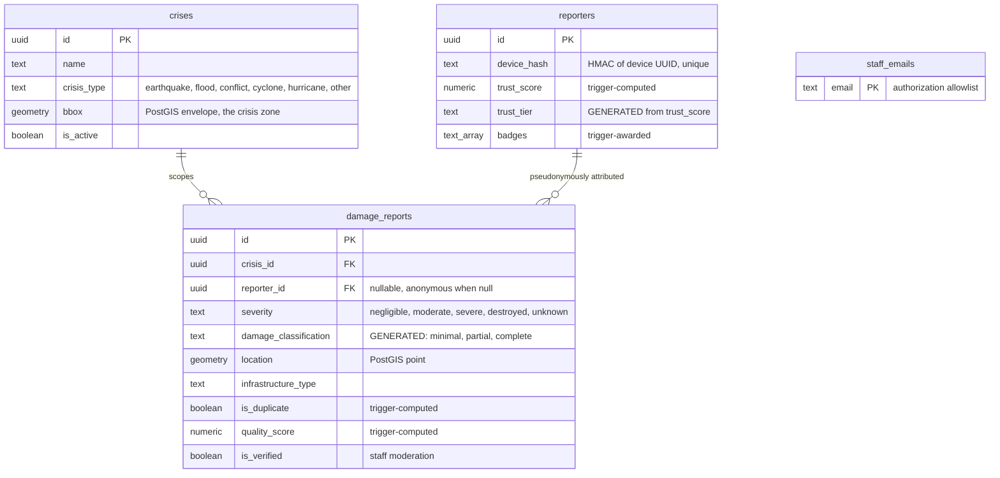

# Architecture

This document explains how CrisisMapper is put together and why. For setup and a feature tour, start with the [README](../README.md).

## Contents

1. [Data model](#data-model)
2. [Geofencing and the Demo Sandbox](#geofencing-and-the-demo-sandbox)
3. [Offline pipeline](#offline-pipeline)
4. [Duplicate detection](#duplicate-detection)
5. [Quality and trust scoring](#quality-and-trust-scoring)
6. [Privacy model](#privacy-model)
7. [Auth boundary](#auth-boundary)
8. [Internationalization and language packs](#internationalization-and-language-packs)
9. [Scale considerations](#scale-considerations)

## Data model

Four tables carry the system. Everything else derives from them.

Two conventions are load-bearing:

- **Severity is stored four-tier, exported three-tier.** Reporters and the AI produce `negligible / moderate / severe / destroyed` (plus `unknown`). The challenge's export schema wants `Minimal / Partial / Complete`. `damage_classification` is a Postgres `GENERATED ALWAYS` column that performs that mapping (`severe` and `destroyed` both collapse to `complete`; `unknown` maps to NULL and is excluded from exports). Application code never writes it.
- **Trigger-computed columns are never written by the app.** `is_duplicate`, `quality_score`, `trust_score`, `trust_tier`, and badge awards are all maintained by insert triggers inside the database. This keeps the scoring rules in one place and means any ingestion channel added later (SMS gateway, partner API) gets identical treatment for free.

## Geofencing and the Demo Sandbox

Operators create a crisis by drawing a bounding box on a map in `/admin/crises`. That box does three jobs:

1. **Reporter attribution.** The reporter flow matches the phone's GPS fix against active crisis boxes client-side (point-in-bbox over a localStorage-cached crisis list, so it works offline). When boxes overlap, the smallest one wins, on the theory that the most specific zone is the right one. The crisis picker only ever offers zones that contain the reporter's location.
2. **Server enforcement.** `POST /api/reports` re-checks the claim: the crisis must exist and be active, and the reported point must intersect the crisis box expanded by 0.25 degrees (roughly 25 km of tolerance for GPS jitter at zone edges). A report from Ghana cannot be filed into a Myanmar crisis even with a hand-crafted request. Rejections use HTTP 422, which the offline queue treats as permanent (see below).
3. **Dashboard framing.** The box sets the initial map extent and the denominator for the coverage statistic.

One special row makes the demo work globally: **Demo Sandbox (Global)**, a crisis whose box is the whole world. Because resolution is smallest-box-wins, any real crisis shadows it; a tester in Accra or Oslo lands in the sandbox instead of being locked out. In a production deployment the sandbox row is simply deactivated.

## Offline pipeline

The defining constraint of the challenge is that connectivity cannot be assumed. CrisisMapper treats offline as the default path, not the exception:

1. **Queue-first.** Every submission, online or not, is written to an IndexedDB table (`pending_reports`, via Dexie) before any network call. The photo blob rides along in the same row.
2. **Drain.** A drain loop posts the metadata, then the photo, then deletes the row. It runs after submit, on the browser `online` event, on tab focus, and (on Android) from the service worker through the Background Sync API, so the OS retries even with the tab closed.
3. **Failure discipline.** A network failure stops the drain (connectivity is probably still down) and the row waits with a retry budget. A validation rejection (HTTP 400, 413, or 422) means the server will never accept the payload, so the row is dropped rather than letting one poison report block everything queued behind it. A successful metadata post with a failed photo upload keeps the report and surfaces a warning, instead of silently losing the photo.
4. **The service worker** precaches the app shell, so `/report` loads with no connectivity at all on a revisit.

The reporter sees this as: submit, get either "submitted" or "saved offline", and a pending badge in the top bar that disappears as the queue drains.

## Duplicate detection

Mass-reporting events generate near-duplicates: thirty people photograph the same collapsed school. A `BEFORE INSERT` trigger flags a report as a probable duplicate when an earlier report exists in the same crisis within 50 meters and 24 hours. Duplicates are kept (they are corroboration signal, see trust below) but excluded by default from the dashboard, statistics, and exports. Analysts can opt back in with `?include_duplicates=true` on the export endpoint.

## Quality and trust scoring

Both scores are computed in SQL triggers at insert time.

**Per-report quality score** (0 to 1) sums:

| Signal | Weight |
|---|---|
| Photo present (AI ran) | 0.30 |
| AI confidence at or above 0.80 | 0.20 |
| GPS fix rather than typed Plus Code | 0.15 |
| Description longer than 20 characters | 0.10 |
| Extended fields filled (electricity, health, needs, vulnerable groups, population) | 0.10 |
| Not a probable duplicate | 0.15 |

**Per-reporter trust score** starts at 0.5 for a fresh device and moves with each attributed report:

| Signal | Delta |
|---|---|
| AI confidence at or above 0.80 | +0.05 |
| GPS location method | +0.03 |
| Not a duplicate | +0.02 |
| Extended fields filled | +0.02 |
| Corroborated by a different reporter within 50 m and 24 h | +0.10 |
| Severity contradicts the AI by more than two grades | -0.08 |

The score is clamped to [0, 1] and a generated column maps it to a tier: below 0.3 **unverified**, below 0.7 **contributing**, otherwise **trusted**. Tiers appear in the dashboard legend and report detail so an analyst can weigh a report by its source's track record without ever knowing who the source is.

Clearing browser storage resets a reporter to a fresh identity at neutral trust. That is an accepted trade-off: identities are cheap, but trust has to be re-earned, which is what makes the score meaningful.

## Privacy model

The design goal is that the public surface is useful for situational awareness while being useless for targeting individuals.

- **Data minimization.** No names, phone numbers, emails, or accounts for reporters. The only identifier is a random UUID generated on the device and kept in localStorage.
- **Pseudonymization.** The server stores an HMAC of that UUID, keyed by `NUXT_REPORTER_SALT`. The raw UUID is never persisted server-side, so even a full database leak cannot be joined back to devices. This is also why the salt must never rotate: hashes are the only link between a device and its history.
- **Anonymous projection.** Read endpoints check for a staff session. Staff get exact coordinates, exact timestamps, and photos. Anonymous requests get coordinates snapped to a roughly 100 m grid (`ST_SnapToGrid(location, 0.001)`), timestamps truncated to the hour, and no photos or free text. The same projection is applied to the realtime broadcast payloads and the public database view, so there is no unguarded path to precise data.
- **Photos** are EXIF-stripped server-side (GPS tags, serial numbers) before storage, and the wizard warns when faces are detected so reporters can retake.
- **The leaderboard** ranks deterministic nicknames derived from the reporter id hash. Names like `anon_swift_falcon` are stable per device but reversible by no one.

## Auth boundary

There is exactly one authentication boundary: `server/utils/requireStaff.ts`. It verifies the Supabase session JWT locally against the project's public keys (no auth-server round trip per request), then checks the email against the `staff_emails` allowlist table. Authentication (Supabase account) and authorization (allowlist) are deliberately separate: a valid login that is not allowlisted is signed out and bounced.

Everything privileged sits behind it: `/api/admin/*`, `/api/export`, `/api/translate`, `/api/auth/me`. Client-side route middleware on `/admin/*` pages provides the UX redirect, but it is a convenience, not the security boundary; a stale client session simply gets 401s from the API. Row Level Security policies on the tables protect the direct anon-key path independently.

Staff accounts are provisioned by other staff in `/admin/staff` (allowlist insert plus Supabase account creation through the service role API), and every staffer can change their own password there. Passwords were chosen over magic links and OAuth for the prototype because they work without a verified sending domain or an identity provider; the production path is to swap the login page for the organization's SSO behind the same `requireStaff` boundary.

## Internationalization and language packs

Seven locales ship in the box: the six UN languages plus Swahili as the proof that the set is open-ended. `i18n/locales/en.json` is the master; an end-to-end test asserts every locale file has exactly the same key set, so a missing translation fails CI rather than silently falling back to English.

Arabic is fully right-to-left: the HTML `dir` attribute follows the locale, layout uses logical CSS properties throughout, and per-locale Noto fonts load only when needed.

New languages do not require a developer. `/admin/languages` machine-translates the English master through a LibreTranslate instance, lets the operator review and correct every string, and downloads a complete locale JSON ready to commit. LibreTranslate is self-hosted on purpose: crisis-related text never leaves operator infrastructure, it works in air-gapped deployments, and there is no vendor dependency or per-request cost. Without an engine the same page works as a manual fill-in editor.

## Scale considerations

The challenge brief anticipates 50,000 reports for sub-national events and 500,000 for large national crises.

- **Map reads are viewport-bounded.** The dashboard fetches only the current viewport, capped at 25,000 features, and refetches on pan and zoom. Markers cluster on the client. Honest totals come from a separate stats endpoint that counts in the database.
- **Exports stream.** GeoJSON and CSV are written from a back-pressured database cursor in 10,000-row batches, so memory stays flat regardless of crisis size. GeoPackage and Shapefile are container formats, so they build in a temp file and stream out.
- **Realtime degrades gracefully.** Live updates ride Supabase Realtime broadcast; repeated connection drops flip the dashboard to a 10-second polling fallback automatically.
- **Writes are one insert.** All scoring runs inside the insert transaction as triggers; gamification work is guarded so a scoring failure can never roll back a report.
